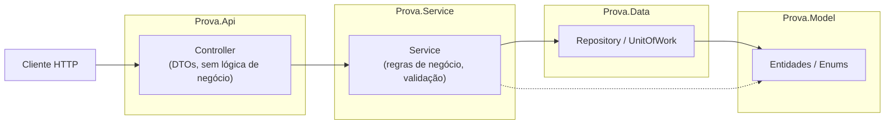
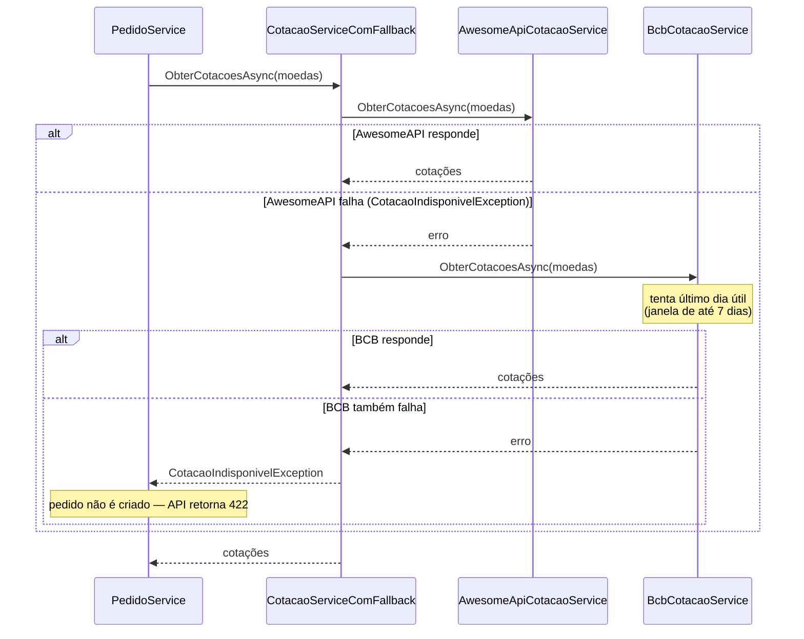

# Prova Prática — Cadastro de Carnes, Compradores e Pedidos

## Visão geral

Aplicação Web para gestão do processo de compra de carnes: cadastro de carnes
e compradores, e registro de pedidos que associam ambos, com precificação por
item negociada no momento do pedido (preço "spot") e conversão para Real via
cotação de câmbio externa (AwesomeAPI, com fallback automático para o
Banco Central).

## Stack e arquitetura

- **Backend**: .NET 8, C#, EF Core, SQL Server. Arquitetura em camadas
  `Controller → Service → Data → Model`, com projetos separados na solution
  (`Prova.Api`, `Prova.Service`, `Prova.Data`, `Prova.Model`, mais os projetos
  de teste `Prova.Service.Tests` e `Prova.Api.Tests`).
- **Frontend**: React + TypeScript + Vite, com TanStack Query para chamadas
  HTTP.

### Camadas (backend)



Cada seta é uma dependência de projeto na solution — `Model` não conhece
nenhuma camada acima dele, e o `Controller` nunca acessa `Data`/`Model`
diretamente (sempre via `Service`, que aplica as regras de negócio e
devolve/recebe DTOs).

### Fluxo de cotação de câmbio (fallback)



`CotacaoServiceComFallback` é um decorator de `ICotacaoService`: a AwesomeAPI
é a fonte primária, o Banco Central (PTAX/Olinda) só é chamado se ela falhar.
Ver "Decisões assumidas" abaixo para o histórico dessa escolha.

## Funcionalidades

- **CRUD de Carne, Comprador e Pedido**, com bloqueio de exclusão de Carne e
  Comprador quando existe algum Pedido/PedidoItem vinculado (`409` no delete).
- **Pedido**: composto por um ou mais itens (`PedidoItem`), cada um com preço
  e moeda próprios (preço "spot", negociado por item). A cotação de moeda
  estrangeira é obtida no momento do `POST`/`PUT` e persistida junto ao
  pedido — a listagem não recalcula (ver "Decisões assumidas" abaixo para o
  detalhe de fonte primária/fallback).
- **Filtro de listagem de pedidos** por comprador e/ou intervalo de data
  (`GET /api/pedidos?compradorId=&dataInicio=&dataFim=`, filtros combináveis
  via AND), com validação inline no frontend quando o intervalo está
  invertido.
- **Dashboard** (`/dashboard` no frontend, `GET /api/dashboard` e
  `GET /api/dashboard/faturamento-por-dia` na API): cards de métrica
  (faturamento, quantidade de pedidos) por período (hoje/semana/mês), ranking
  top 5 carnes e compradores, e gráfico de faturamento diário.
- **Modal de confirmação** antes de qualquer exclusão (Carne, Comprador,
  Pedido) e **feedback visual de sucesso/erro** em toda operação de escrita
  (toast de sucesso, banner de erro com a lista de mensagens do backend).
- **Middleware de erro global** no Controller (`ExceptionHandlingMiddleware`):
  nenhum try/catch espalhado pelo código; todo erro de negócio/validação vira
  uma resposta consistente no formato `ErroRespostaDto` (`{ "erros": [...] }`),
  nunca expondo stack trace ao cliente.
- **Responsivo em mobile/tablet** (<768px): sidebar vira hamburger menu com
  overlay, tabelas viram cards empilhados (técnica `data-label`), filtros de
  pedidos empilham verticalmente, botão "Novo" vira FAB fixo, e o Dashboard
  tem breakpoint próprio de 1024px para a grade de cards/rankings.

## Estrutura do repositório

```
backend/    Solution .NET (Prova.sln) — API, camadas Service/Data/Model, testes
frontend/   Aplicação React + TypeScript (Vite)
docs/       PRD, backlog e script SQL standalone do schema
```

## Pré-requisitos

- .NET 8 SDK
- Node.js (versão compatível com Vite 8 / React 19, recomendado 20+) e npm
- SQL Server ou SQL Server LocalDB (para desenvolvimento local)
- Ferramenta `dotnet-ef` instalada globalmente, **apenas** se optar por subir
  o banco via migrations (`dotnet tool install --global dotnet-ef`)

## 1. Subindo o banco de dados

Existem duas formas de preparar o banco — escolha uma:

### Opção A — via EF Core Migrations

Requer SQL Server (instância local, Express ou LocalDB) rodando e a
ferramenta `dotnet-ef` instalada. A connection string usada está em
`backend/Prova.Api/appsettings.json`:

```
Server=localhost\SQLEXPRESS;Database=ProvaCarnes;Trusted_Connection=True;TrustServerCertificate=True
```

Se sua instância local tiver outro nome (ex.: instância padrão sem nome,
`(localdb)\mssqllocaldb`, ou outro nome de instância nomeada), ajuste o
`Server=` acima antes de rodar as migrations.

A partir de `backend/Prova.Api`:

```bash
dotnet ef database update
```

Isso cria o banco `ProvaCarnes`, aplica o schema completo e popula as tabelas
de apoio `Estado`/`Cidade` via seed da migration.

> **Nota:** as ferramentas do EF Core sempre usam a implementação de
> `IDesignTimeDbContextFactory` do projeto (`Prova.Data/Context/AppDbContextFactory.cs`)
> para comandos `dotnet ef`, **independente da pasta de onde o comando é
> executado** — ela é quem decide a connection string de migration, não o
> `Program.cs`/`appsettings.json` diretamente. Por isso essa factory lê a
> mesma connection string de `appsettings.json`, garantindo que design-time e
> runtime sempre apontem para o mesmo banco.

### Opção B — via script SQL standalone (mais simples, sem `dotnet ef`)

Um script SQL gerado a partir das migrations está em
[`docs/database/schema.sql`](docs/database/schema.sql). Ele cria o schema
completo (tabelas, PKs/FKs) e já inclui os inserts de seed de `Estado`/
`Cidade`. Basta executá-lo diretamente em uma instância de SQL Server (ex.:
via SQL Server Management Studio, Azure Data Studio ou `sqlcmd`) apontando
para um banco `ProvaCarnes` vazio. É a alternativa recomendada para quem só
quer subir o banco rápido, sem instalar o `dotnet-ef` tool.

## 2. Rodando o backend

A partir da pasta `backend/`:

```bash
dotnet restore
dotnet run --project Prova.Api
```

A API sobe em `http://localhost:5299` (perfil `http` de
`backend/Prova.Api/Properties/launchSettings.json`). Em ambiente
`Development`, o Swagger fica disponível em `http://localhost:5299/swagger`.

## 3. Rodando os testes do backend

A partir da pasta `backend/`:

```bash
dotnet test
```

Cobre testes unitários das regras de negócio da camada Service (xUnit +
mock de repositório) e testes de integração dos controllers
(`WebApplicationFactory`), incluindo os status codes principais de cada
endpoint (200/201/404/409/422).

## 4. Rodando o frontend

A partir da pasta `frontend/`:

```bash
npm install
npm run dev
```

A aplicação sobe em `http://localhost:5173`. A URL base da API é configurada
pela variável de ambiente `VITE_API_BASE_URL`, já definida por padrão em
`frontend/.env.development` como `http://localhost:5299/api` (aponta para o
backend do passo 2).

Outros comandos úteis:

```bash
npm run test    # Vitest — validação de formulário e comportamento de modal
npm run build   # build de produção (tsc + vite build)
```

## 5. Ordem de subida recomendada

1. Banco de dados (passo 1)
2. Backend (passo 2), em `http://localhost:5299`
3. Frontend (passo 4), em `http://localhost:5173`

Essa ordem importa porque o CORS do backend está restrito explicitamente à
origem `http://localhost:5173` (nunca `AllowAnyOrigin()`) — o frontend
precisa rodar exatamente nessa porta para conseguir chamar a API em
desenvolvimento.

## Decisões assumidas

Estas decisões estão documentadas em detalhe em `docs/PRD.md`; resumo abaixo
o que mais impacta quem for avaliar ou dar manutenção no projeto:

- **`PedidoItem` como entidade associativa** entre `Pedido` e `Carne`, com
  **Preço e Moeda próprios por item** — o preço é "spot", negociado
  livremente por item no momento do pedido, e não segue uma tabela de preço
  fixa por carne/origem.
- **Cotação de câmbio congelada no pedido**: no `POST /pedidos` (e no
  `PUT /pedidos/{id}` quando a edição altera itens/preço/moeda), a cotação de
  cada moeda estrangeira usada é obtida e persistida junto ao pedido/itens —
  **não é recalculada na listagem**. Isso garante que o valor histórico do
  pedido não mude retroativamente com a flutuação do câmbio. A fonte primária
  da cotação é a **AwesomeAPI**; o **Banco Central** (serviço PTAX/Olinda,
  endpoints `CotacaoMoedaDia`/`CotacaoMoedaPeriodo`, campo `cotacaoCompra` do
  retorno) entra como **fallback automático** somente se a AwesomeAPI falhar.
  Quando o BCB é acionado como fallback, ele mantém seu comportamento interno
  de tentar o **último dia útil disponível**: se `CotacaoMoedaDia` de hoje
  vier vazio (fim de semana/feriado), busca via `CotacaoMoedaPeriodo` numa
  janela de até **7 dias corridos** pra trás antes de desistir — esse
  comportamento não mudou, só a ordem de quem é chamado primeiro. Se as duas
  fontes falharem, o pedido/edição **não é salvo** e a API retorna `422` com
  mensagem clara — sem criação parcial, sem fallback para cotação antiga e
  sem loading infinito no frontend. Histórico da fonte primária: já foi
  trocada duas vezes — AwesomeAPI (original) → BCB (após relato de
  instabilidade da AwesomeAPI ao testar criação de pedido, quando também foi
  adicionada a janela de 7 dias) → AwesomeAPI novamente (decisão explícita
  do usuário, com o BCB permanecendo como rede de segurança). Trade-off que
  segue relevante enquanto o BCB puder ser chamado (como fallback): seu
  endpoint não aceita múltiplas moedas numa única chamada (diferente da
  AwesomeAPI), então a integração faz **1 requisição HTTP por moeda
  estrangeira distinta** usada no pedido (hoje, no máximo duas — USD e EUR).
- **Delete bloqueado** para `Carne` e `Comprador` que possuam vínculo
  existente (`PedidoItem`/`Pedido`, respectivamente). A regra é aplicada às
  duas entidades por consistência de integridade, ainda que a especificação
  original mencionasse isso explicitamente só para Carne.
- **Não existe "cancelamento de pedido"** como conceito separado de exclusão
  — o CRUD de Pedido cobre o ciclo de vida completo, fora de escopo desta
  prova.
- **Ausência de autenticação/autorização é uma decisão consciente de
  escopo**, não um esquecimento. A especificação da prova não menciona
  controle de acesso, e implementar um login parcial/incompleto traria mais
  risco de segurança do que a ausência total. Todos os endpoints da API estão
  abertos nesta entrega.
- **Filtro de listagem de pedidos por comprador/data** — item "Could" do
  backlog (`docs/BACKLOG.md`), implementado nos dois lados: a API expõe
  `GET /api/pedidos?compradorId=&dataInicio=&dataFim=` com filtros
  combináveis via AND, e a tela de listagem de Pedidos tem um seletor de
  comprador e campos de intervalo de data correspondentes, com validação
  inline quando o intervalo está invertido.
- **Carnes e Compradores usam o mesmo padrão de navegação que Pedidos**:
  botão "Novo" na listagem + rota separada de formulário (`/carnes/novo`,
  `/carnes/:id/editar`, e equivalente para Compradores), em vez de abas
  "Consultar"/"Cadastrar" empilhadas na mesma página. As três telas passaram
  a seguir o mesmo padrão depois de testes manuais do usuário — a navegação
  por abas usada inicialmente em Carnes/Comprador foi removida e substituída
  por esse padrão único.

Outras premissas menores (documento sem validação de dígito verificador,
ausência de campo de quantidade por item, mesma carne podendo aparecer mais
de uma vez no mesmo pedido, etc.) estão detalhadas em `docs/PRD.md`, seção
"Premissas assumidas".
